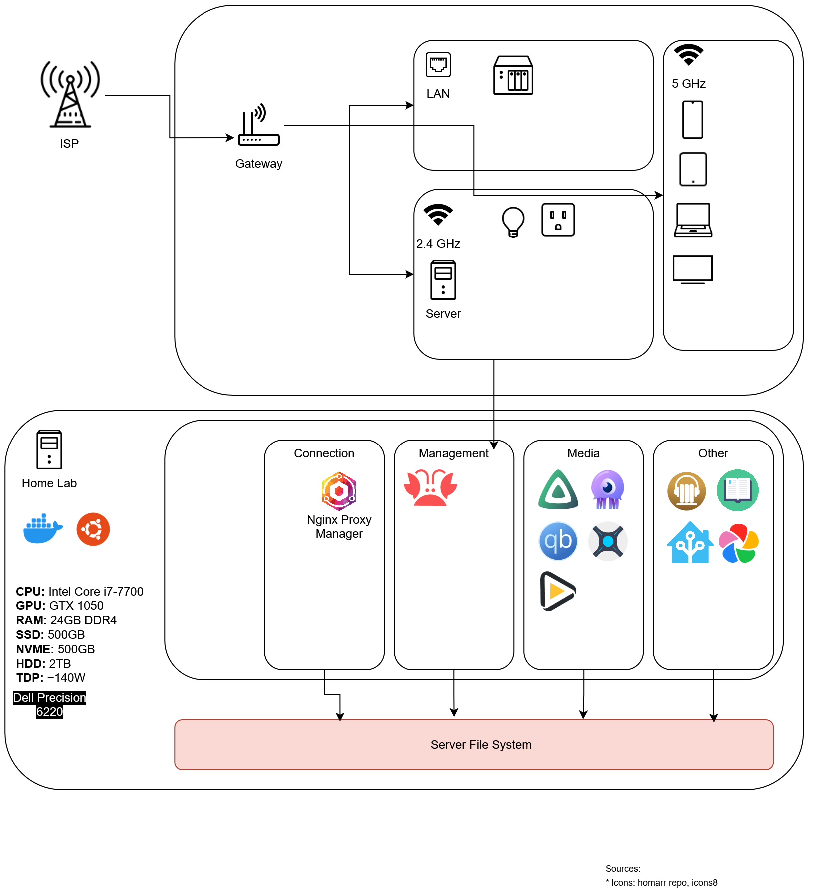

# Home Server

Personal home server running a collection of self-hosted services with Docker Compose.



## Services

### Media

* **Jellyfin** — Media server
* **Immich** — Photo and video management
* **Audiobookshelf** — Audiobooks and podcasts
* **Kavita** — Books, comics and manga

### Media Automation

* **Sonarr** — TV series automation
* **Radarr** — Movie automation
* **Lidarr** — Music automation
* **Prowlarr** — Indexer management
* **Bazarr** — Subtitle management
* **Jellyseerr** — Media requests
* **Recyclarr** — Quality profile synchronization
* **Wizarr** — User management

### Home & Network

* **Home Assistant** — Home automation
* **Whisper / Piper** — Local speech processing
* **Tailscale** — Private network access
* **Nginx Proxy Manager** — Reverse proxy

### Management

* **Portainer** — Docker management
* **Uptime Kuma** — Monitoring
* **Homarr** — Dashboard
* **Notifiarr** — Notifications

### Other

* **qBittorrent / Gluetun** — Downloads and VPN networking
* **Syncthing** — File synchronization
* **Wallos** — Finance and subscriptions
* **Mealie** — Recipes and meal planning
* **CVAT** — Computer vision annotation

## Structure

The server is split into independent Docker Compose stacks:

```text
connection/
finances/
homeassistant/
immich/
management/
media-server/
syncthing/
```

Each stack can be managed independently with Docker Compose.

## Usage

Clone the repository and enter the stack you want to run:

```bash
git clone https://github.com/sukhov-andrii/media-server.git
cd media-server/<stack>
```

Start a stack:

```bash
docker compose up -d
```

Update it:

```bash
docker compose pull
docker compose up -d
```

Check status:

```bash
docker compose ps
```

## Configuration

Service configuration is stored in the repository where appropriate. Secrets, credentials, databases and persistent application data are kept outside Git.

See `docs/` for additional notes and server-specific documentation.

## Status

Personal infrastructure project, continuously updated as services and configuration change.
